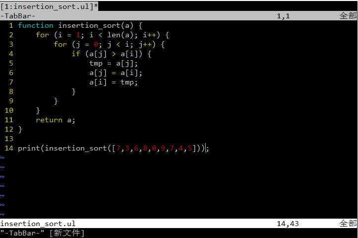
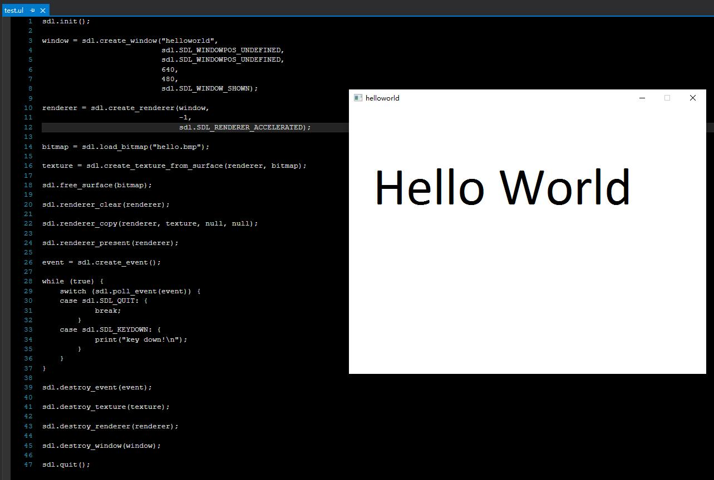

## 运行示例




## 运算符（按优先级排序）

// 赋值表达式
```
v = 1024;
v += 10;
v -= 10;
v *= 10;
v /= 10;
v %= 10;
v &= 10;
v |= 10;
v ^= 10;
v >>= 10;
v >>>= 10;
v <<= 10;
print(v);
```

// 逻辑或表达式，支持短路求值
```
print(true || false); 
```

// 逻辑与表达式，支持短路求值
```
print(true && true);  
```

// 相等表达式
```
print(1 == 1);
print(1 != 2);
```

// 关系表达式
```
print(1 < 2);
print(1 <= 2);
print(2 > 1);
print(2 >= 1);
```

// 加法表达式
```
print(1+2);
print(1-2);
```

// 乘法表达式
```
print(1*2);
print(2/1);
print(3%2);
```

// 位运算表达式
```
print(1 | 2);
print(1 & 3);
print(1 ^ 1);
```

// 位移表达式
```
print(1 << 1);
print(2 >> 1);
print(-1 >>> 1);
```

// 一元表达式
```
print(+1);
print(-1);
print(!true);
print(~1);
```

// 最高优先级
```
print( (1+2+3) );
print( [1,2,3][2] );
print( [1,2,3] <- 4 );
print( [1,2,3,4] -> a);
print( {a:"helloworld"}.a );
a = 1;
print( a++ );
print( a-- );
```

## 函数

`ulcer`的函数声明同javascript一样。

```
function funcname(a, b, c, d) {
}
```

如果一个`function`没有返回值，那么它将默认返回一个`null`值。

同样，`ulcer`的函数也带有词法定界（lexical scoping）的第一类值（first-class values）。所以，在`ulcer`当中可以把一个`function`直接赋值给一个变量。

```
f = function(){};
```

```
function new_counter() {
    i = 0;
    return function() {
        i++;
        return i;
    }
}

c1 = new_counter();
print(c1(), "\n");
print(c1(), "\n");
```

程序运行结果是：

```
1
2
```

## 流程控制

`ulcer`支持`if/elif/else`和`switch`两种分支控制方式，语法同javascript/C类似。

```
if (condition) {
} elif (condition) {
} else {
}
```
```
switch (v) {
case 'helloworld':
    {
    }
default:
    {
    }
}
```

`ulcer`支持`for`，`foreach`和`while`三种循环控制，其中`for`和`while`语法同javascript类似。

```
for (i = 0; i < 10; i++) {
}
```

```
while (true) {
}
```

`ulcer`另外提供了`foreach`循环控制用于迭代array和table类型。

```
foreach(k, v : table) {
}
```

## 类型

`ulcer`支持以下几种类型，其中，array和table属于引用类型，而其它属于值类型。

```
vnull = null;
vbool = true;
vint = 1;
vlong = 1l;
vfloat = 1.0f;
vdouble = 1.0;
vstring = "HelloWorld";
varray = [1,2,3,4,5];
vtable = {1:vint, "hello":"world"};
vfunction = function(){};
vpointer = file.open("test.txt", "r");
```

## table

`ulcer`的table目前只实现了一个简单的hash table功能，但是table的key和value都可以是`ulcer`支持的所有类型。同时，可以使用成员操作符直接访问用key为string的成员。

```
t = {1:"one", "hello":"world"}
t.field = "helloworld";
print(t.field, t.hello);
```

## array

`ulcer`的array于js的array差不多，它的成员可以是任意的ulcer支持的类型的值，但是`ulcer`多提供了两个stack操作语法。

```
[1,2,3] <- 4;   // push ([1,2,3], 4) ==>> [1,2,3,4]
[1,2,3,4] -> v; // v = pop ([1,2,3,4]) ==>> v == 4
```

## 包管理

`ulcer`的包管理同lua类似。

```
// fibonacci.ul

function fibonacci(n) {
    if(n == 1) {
        return 1;
    }
    return fibonacci( n - 1 ) * n;
}
```

```
// main.ul
require "fibonacci"
print(fibonacci(10), "\n");
```

`require`关键字只是简单地将`fibonacci`这个包作为源文件运行，然后将`fibonacci`运行结果保存到`main`的上下文当中。

## 原型链

这个功能我还在考虑着要不要加上。

## 内置库

```
string
math
runtime
heap
file
sdl
```

## 内置函数

```
print(any_value...);
len(any_value);
type(any_value);
version();
```
